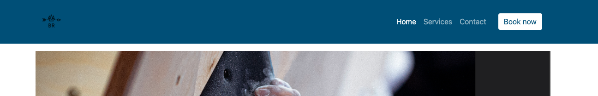
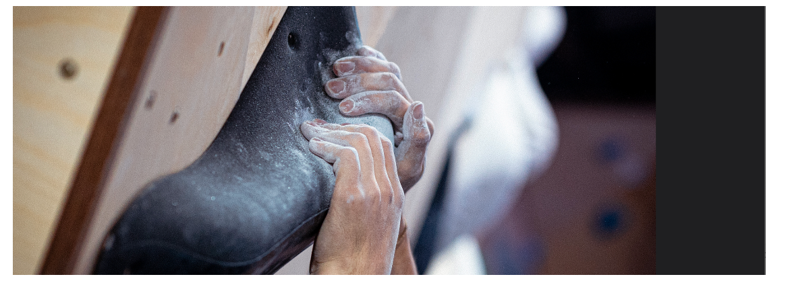
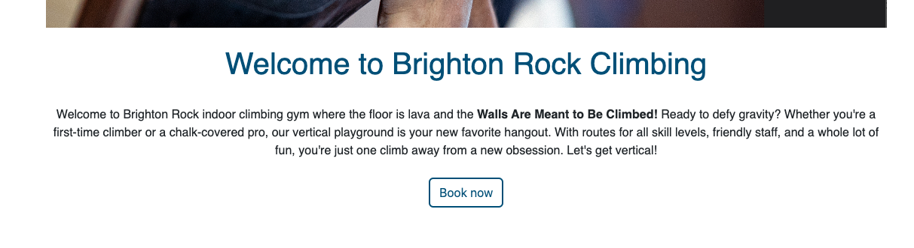
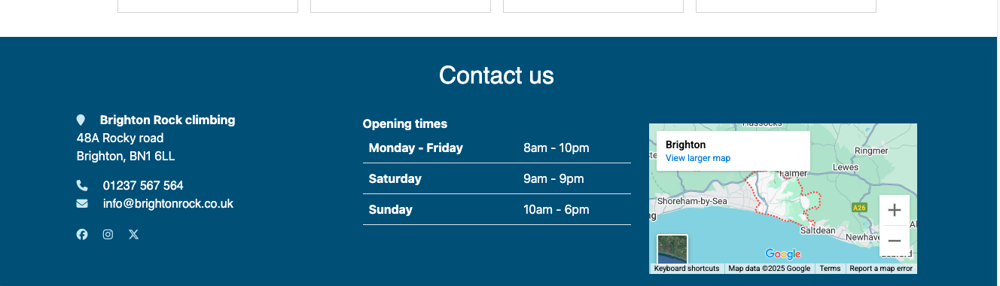
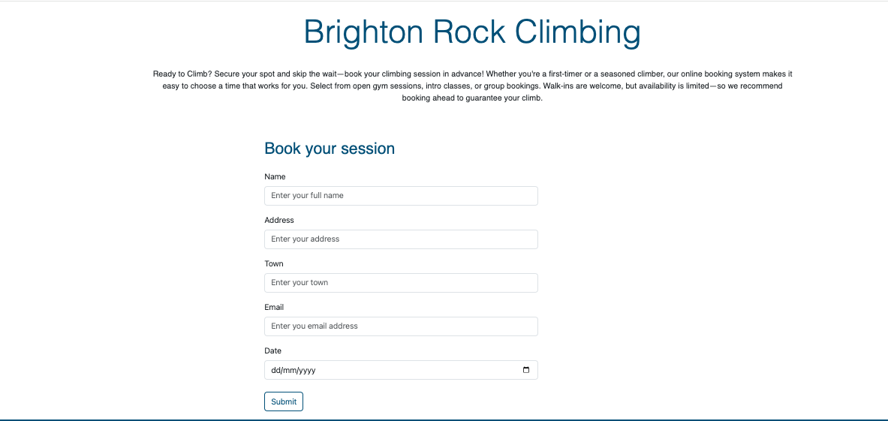
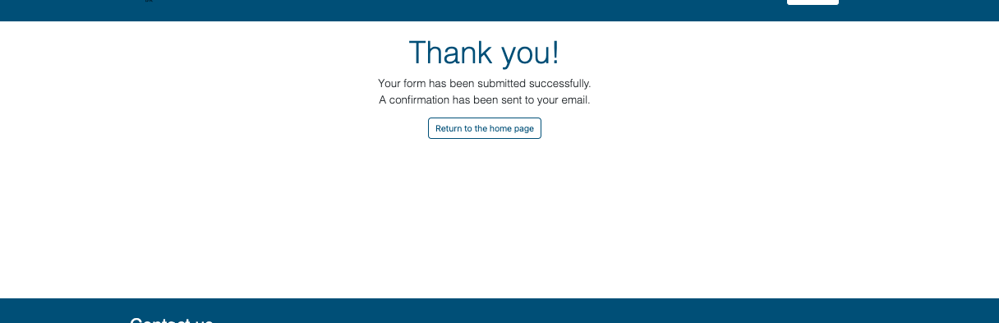
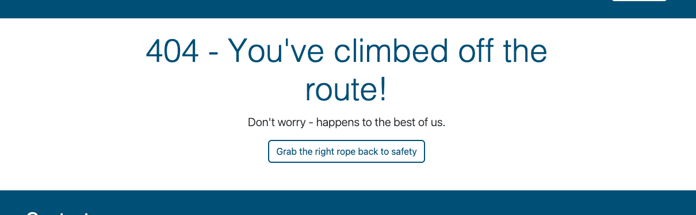
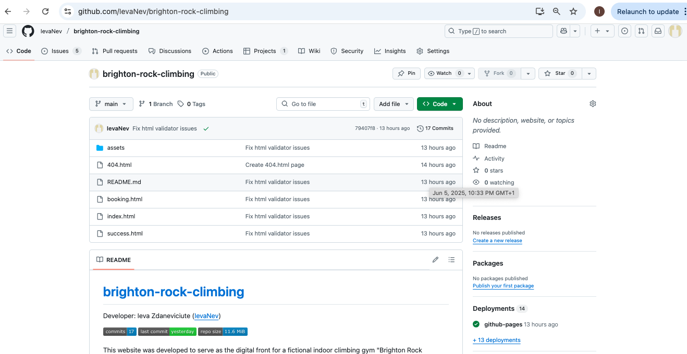
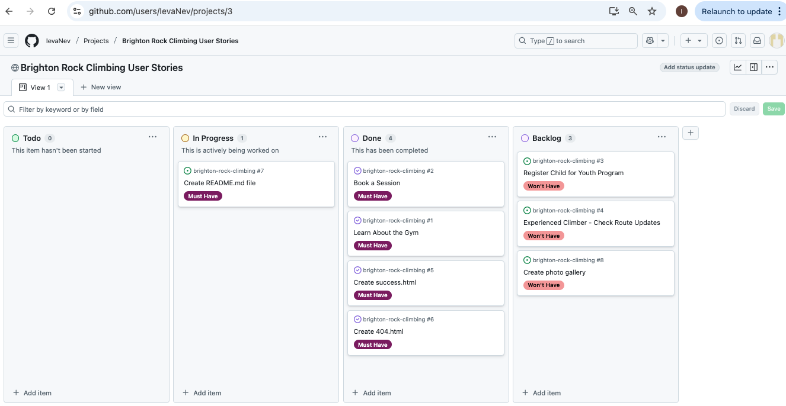

# [brighton-rock-climbing](https://ievanev.github.io/brighton-rock-climbing)

Developer: Ieva Zdaneviciute ([IevaNev](https://www.github.com/IevaNev))

This website was developed to serve as the digital front for a fictional indoor climbing gym "Brighton Rock Climbing" providing user friendly platform to showcase the services, contact information and a booking form to book a climbing session. The goal is to deliver a responsive, accessible and informative experience for visitors, with an emphasis on usability and clear navigation. This README outlines the website's purpose, core features and the technical stack.

## UX

### The 5 Planes of UX

#### 1. Strategy

**Purpose**
- Encourage users to join the climbing gym.
- Provide a seamless user experience to keep users informed and engaged.

**Primary User Needs**
- Learn about gym's purpose and events.
- Join the gym and stay updated.
- Access responsive, user-friendly content.

**Business Goals**
- Increase gym's membership.
- Boost participation in events and social media engagement.

#### 2. Scope

**[Features](#features)** (see below)

**Content Requirements**
- Clear, motivational text about the gym's mission.
- Photos showcasing the community.
- Forms for booking session/sign-up.

#### 3. Structure

**Information Architecture**
- **Navigation Menu**:
  - Accessible links in the navbar.
- **Hierarchy**:
  - Clear call-to-action buttons.
  - Prominent placement of social media links in the footer.

**User Flow**
1. User lands on the home page → learns about the gym's mission and services.
2. Navigates to the timetable, contacts and map → sees location and contact info.
3. Call to action buttons on navbar and header → booking form.
4. Signs up via the booking page.

#### 4. Skeleton

**[Wireframes](#wireframes)** (see below)

#### 5. Surface

**Visual Design Elements**
- **[Colours](#colour-scheme)** (see below)
- **[Typography](#typography)** (see below)

### Colour Scheme

I used https://imagecolorpicker.com/ to pick colors from one of climbing images used on website. Then added variables in CSS for ease of use troughout developing process.

--primary-color: #154c79; /* blue */

--secondary-color: #cde8f6; /* light blue */

### Typography

- [Inter] (https://fonts.google.com/?query=inter)was used for the primary headers and titles.
- [Noto](https://fonts.google.com/?query=noto) was used for all other secondary text.
- [Font Awesome](https://fontawesome.com) icons were used throughout the site, such as the social media icons in the footer.

## Wireframes

To follow best practice, wireframes were developed for mobile, tablet, and desktop sizes.
I've used [Balsamiq](https://balsamiq.com/wireframes) to design my site wireframes.
Screenshots included in documentation/wireframes.

## User Stories

| Target | Expectation | Outcome |
| --- | --- | --- |
| As a user | I would like to learn more about the gym (location, hours and amenities) | So that I can decide if I want to visit or sign up. |
| As a user | I would like to book a session. | So that I can make sure there's space available when I visit. |
| As a user | I would like to register my child for a youth prohram. | So that I can plan and prepare accordingly. |
| As an user | I would like to view a gallery of past events | So that I can see photos from previous events. |
| As a user | I would like to see the route updates | So that I can plan my session and challenge myself. |
| As a user | I would like the website to be fully responsive | so that I can easily navigate and access information from my phone, tablet, or desktop. |
| As a user | I would like to see a 404 error page if I get lost | so that it's obvious that I've stumbled upon a page that doesn't exist. |

## Features

### Existing Features

| Feature | Notes | Screenshot |
| --- | --- | --- |
| Navbar | Featured on all four pages, the full responsive navigation bar includes links to the Logo, Home page, Services, Contacts and Booking page, and is identical in each page to allow for easy navigation. On the smallest screens, a burger icon is used to toggle the navbar so it doesn't take up too much space. This section will allow the user to easily navigate from page to page across all devices without having to revert back to the previous page via the "back" button. |  |
| Hero Image | The landing includes a photo. This section introduces the user to *Brighton Rock Climbing* with an eye-catching image to grab their attention. |  |
| Gym's Ethos | The gym's ethos section will allow the user to see the benefits of joining the gym. This should encourage the user to consider climbing as their form of exercise. |  |
| Opening times | This section will allow the user to see exactly when the gym is open. |  |
| Footer | The footer includes address, phone number and email as well as links to the relevant social media sites for the gym. Map and openng times are also in the footer. The links will open in a new tab to allow easy navigation for the user. The footer is valuable to the user, as it encourages them to keep connected via social media. |  |
| Booking page | This page will allow the user to book a session at *Brighton Rock Climbing* and start their climbing journey with the community. |  |
| Confirmation - success page | The confirmation page will give the illusion that the signup form was submitted successfully to the gym. Due to the lack of a database or email system so far, this is a fake confirmation page, and will allow user to use the button to go back to homepage. |  |
| 404 | The 404 error page will indicate when a user has somehow navigated to a page that doesn't exist. This replaces the default GitHub Pages 404 page, and ties-in with the look and feel of the *Brighton Rock Climbing* site by using the standard navbar and footer. |  |

### Future Features

- **Personalized User Profiles**: Allow users to create accounts where they can track their climbing progress, view personal stats, share their achievements and see their membersip info.
- **Training Plans**: Offer customizable training plans for climbers of all levels (beginner, intermediate, advanced) with notifications and reminders.
- **Event Registration & Payment**: Integrate an option for climbers to register and pay for upcoming events or races directly through the site.
- **Achievements & Badges**: Introduce a gamification system where users earn badges or achievements for reaching milestones (e.g., number of climbs, personal grade achievements, attending events).
- **Interactive Maps**: Display interactive maps where climbers can add their climbs from other locations (e.g. other gyms, bouldering or climbing in nature setting).
- **Live Event Tracking**: Provide real-time tracking for major club events so users can follow along or support friends climbing in real-time.
- **Runner's Blog**: Include a blog section for members to share their climbing experiences, tips, and stories, fostering community engagement.
- **Leaderboards**: Add a feature where users can compare their climbing stats with others in the gym via leaderboards (e.g., hardest route climbed, session times).
- **Weekly Challenges**: Implement monthly climbing challenges or group challenges to keep users motivated and engaged.
- **Social Sharing**: Enable users to share their climbs, achievements, or event participation directly on social media from the site.
- **Club Merchandise Store**: Introduce an online store where users can purchase branded climbing gear like t-shirts, climbing accesories, water bottles.
- **Push Notifications**: Allow users to opt-in for mobile push notifications for schedule updates, new events, or motivational reminders.
- **Member Forums or Groups**: Introduce discussion boards or group chats for climbers to connect, discuss upcoming events, or share training tips.

## Tools & Technologies

| Tool / Tech | Use |
| --- | --- |
|  | Generate README and TESTING templates. |
|  | Version control. (`git add`, `git commit`, `git push`) |
|  | Secure online code storage. |
|  | Local IDE for development. |
|  | Main site content and layout. |
|  | Design and layout. |
|  | Hosting the deployed front-end site. |
|  | Front-end CSS framework for modern responsiveness and pre-built components. |
|  | Creating wireframes. |
|  | Icons. |
|  | Help debug, troubleshoot, and explain things. |
|  | Tutorials/Reference Guide |

## Agile Development Process

### GitHub Projects

[GitHub Projects](https://www.github.com/IevaNev/brighton-rock-climbing/projects) served as an Agile tool for this project. Through it, EPICs, User Stories, issues/bugs, and Milestone tasks were planned, then subsequently tracked on a regular basis using the Kanban project board.

### MoSCoW Prioritization

I've decomposed my Epics into User Stories for prioritizing and implementing them. Using this approach, I was able to apply "MoSCoW" prioritization and labels to my User Stories within the Issues tab.

- **Must Have**: guaranteed to be delivered - required to Pass the project (*max ~60% of stories*)
- **Should Have**: adds significant value, but not vital (*~20% of stories*)
- **Could Have**: has small impact if left out (*the rest ~20% of stories*)
- **Won't Have**: not a priority for this iteration - future features

## Testing

> [!NOTE]
> For all testing, please refer to the [TESTING.md](TESTING.md) file.

## Deployment

### GitHub Pages

The site was deployed to GitHub Pages. The steps to deploy are as follows:

- In the [GitHub repository](https://www.github.com/IevaNev/brighton-rock-climbing), navigate to the "Settings" tab.
- In Settings, click on the "Pages" link from the menu on the left.
- From the "Build and deployment" section, click the drop-down called "Branch", and select the **main** branch, then click "Save".
- The page will be automatically refreshed with a detailed message display to indicate the successful deployment.
- Allow up to 5 minutes for the site to fully deploy.

The live link can be found on [GitHub Pages](https://ievanev.github.io/brighton-rock-climbing).

### Local Development

This project can be cloned or forked in order to make a local copy on your own system.

#### Cloning

You can clone the repository by following these steps:

1. Go to the [GitHub repository](https://www.github.com/IevaNev/brighton-rock-climbing).
2. Locate and click on the green "Code" button at the very top, above the commits and files.
3. Select whether you prefer to clone using "HTTPS", "SSH", or "GitHub CLI", and click the "copy" button to copy the URL to your clipboard.
4. Open "Git Bash" or "Terminal".
5. Change the current working directory to the location where you want the cloned directory.
6. In your IDE Terminal, type the following command to clone the repository:
	- `git clone https://www.github.com/IevaNev/brighton-rock-climbing.git`
7. Press "Enter" to create your local clone.

Alternatively, if using Gitpod, you can click below to create your own workspace using this repository.

**Please Note**: in order to directly open the project in Gitpod, you should have the browser extension installed. A tutorial on how to do that can be found [here](https://www.gitpod.io/docs/configure/user-settings/browser-extension).

#### Forking

By forking the GitHub Repository, you make a copy of the original repository on our GitHub account to view and/or make changes without affecting the original owner's repository. You can fork this repository by using the following steps:

1. Log in to GitHub and locate the [GitHub Repository](https://www.github.com/IevaNev/brighton-rock-climbing).
2. At the top of the Repository, just below the "Settings" button on the menu, locate and click the "Fork" Button.
3. Once clicked, you should now have a copy of the original repository in your own GitHub account!

### Local VS Deployment

There are no remaining major differences between the local version when compared to the deployed version online.

## Credits

### Content

| Source | Notes |
| --- | --- |
| [Markdown Builder](https://markdown.2bn.dev) | Help generating Markdown files |
| [Code Institute](https://codeinstitute.net) | Code Institute walkthrough project inspiration |
| [Bootstrap](https://getbootstrap.com) | Various components / responsive front-end framework |
| [ChatGPT](https://chatgpt.com) | Help with code logic and explanations |

### Media

| Source | Notes |
| --- | --- |
| [favicon.io](https://favicon.io) | Generating the favicon |
| [Font Awesome](https://fontawesome.com) | Icons used throughout the site |
| [Gecko climbing gym] (https://www.geckoclimbinggym.com) | hero image |
| [Gecko climbing gym] (https://www.insure4sport.co.uk/blog/rock-climbing-equipment/) | equipment image |
| [Gecko climbing gym] (https://geckoclimbinggym.smugmug.com/3rd-Anniversary-Party/i-m9cXSpV/A) | youth image |
| [Gecko climbing gym] (https://geckoclimbinggym.smugmug.com/3rd-Anniversary-Party/i-szCJfs7/A) | social image |
| [Gecko climbing gym] (https://kernigkrafts.com/blog/how-design-cafe/) | cafe image |

### Acknowledgements

- I would like to thank my Code Institute mentor, [Tim Nelson](https://www.github.com/TravelTimN) for the support throughout the development of this project.
- I would like to thank the [Code Institute](https://codeinstitute.net) Tutor Team for their assistance with troubleshooting and debugging some project issues.
- I would like to thank the [Code Institute Slack community](https://code-institute-room.slack.com) for the moral support; it kept me going during periods of self doubt and impostor syndrome.
- I would like to thank my partner, for believing in me, and allowing me to make this transition into software development.

